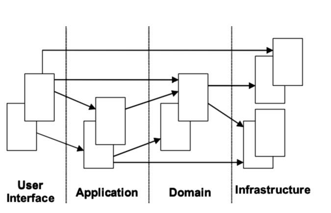
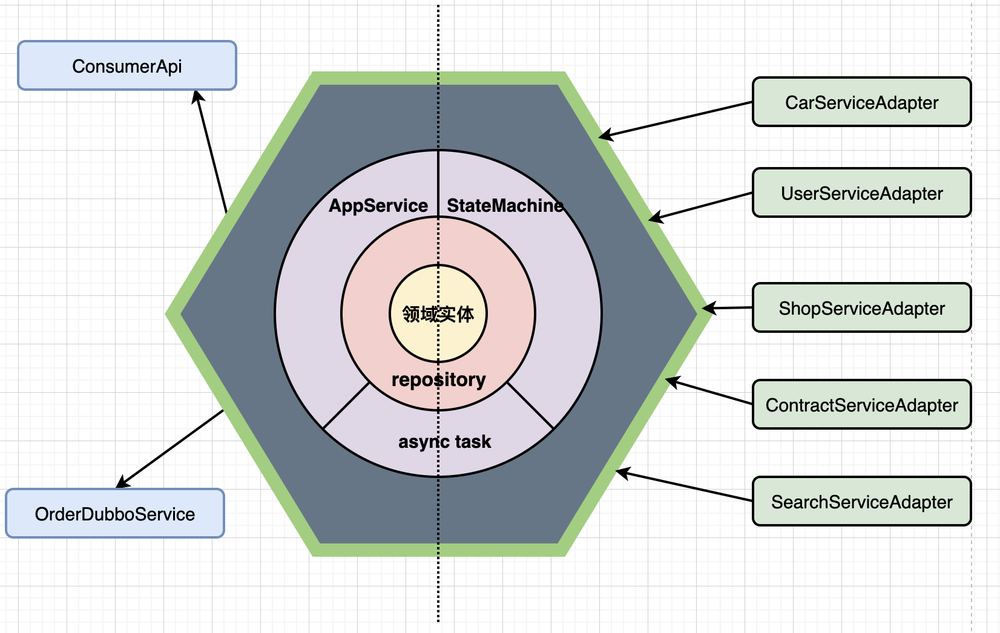
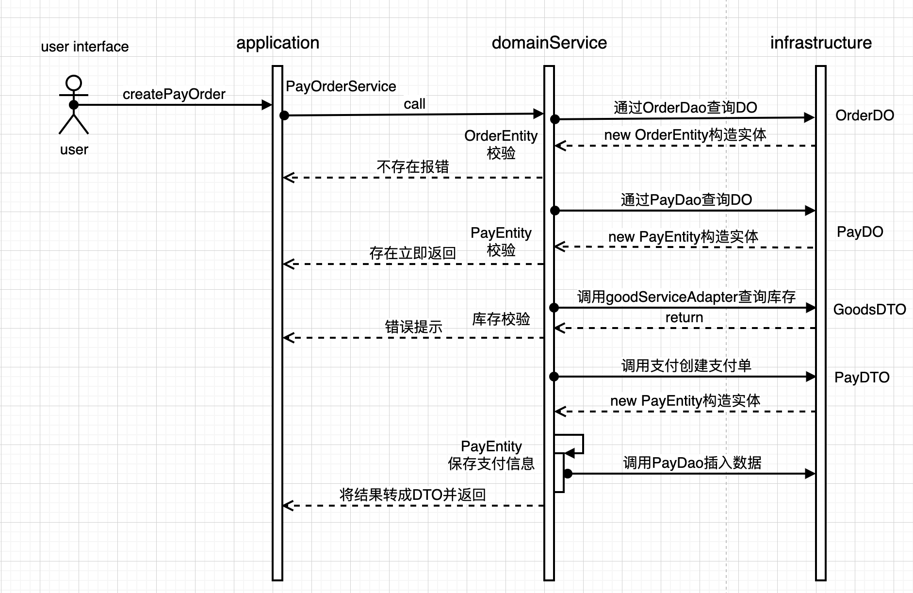
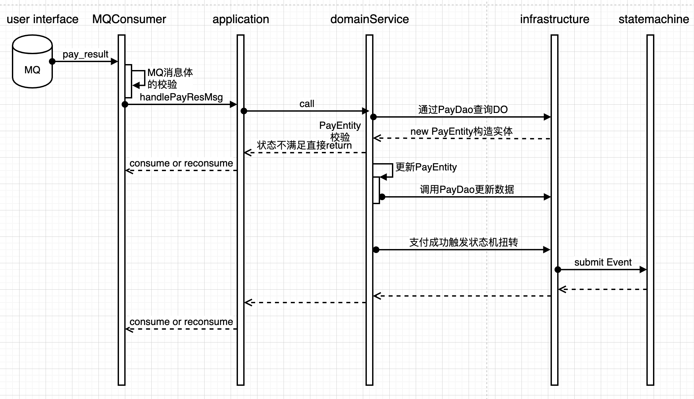

# [你在教我做事?]系列之老三层架构到DDD的实战

> 你在教我做事啊?这一波我又大了七八个,还全部大残

## 订单案例

> 为了避免整篇文章比较枯燥,这里列举一个现实生产的业务案例,暂定叫做XX买车平台


用户买车会经过一系列的动作,经过风控 => 生成订单 => 签署合同 => 付钱 => 扣除库存 => 进行配货 => 通知提车 => 交易成功

这个流程是精简过的,实际的生产流程比这个复杂点,但基本可以说清楚一个买车流程的交互了

### 传统老三层MVC架构

> 首先我们来回忆或者复习一下经典的MVC架构

#### MVC的一些概念

**模型（Model）** 用于封装与应用程序的业务逻辑相关的数据以及对数据的处理方法。“ Model ”有对数据直接访问的权力，例如对数据库的访问。“Model”不依赖“View”和“Controller”，也就是说， Model 不关心它会被如何显示或是如何被操作。但是 Model 中数据的变化一般会通过一种刷新机制被公布。为了实现这种机制，那些用于监视此 Model 的 View 必须事先在此 Model 上注册，从而，View 可以了解在数据 Model 上发生的改变。

**视图（View）**能够实现数据有目的的显示（理论上，这不是必需的）。在 View 中一般没有程序上的逻辑。为了实现 View 上的刷新功能，View 需要访问它监视的数据模型（Model），因此应该事先在被它监视的数据那里注册。

**控制器（Controller）**起到不同层面间的组织作用，用于控制应用程序的流程。它处理事件并作出响应。“事件”包括用户的行为和数据 Model 上的改变。


MODEL层映射到VIEW层,给用户展示;用户对MODEL使用更新通过CONTROLLER层去操作

那么这种MVC架构映射到我们的Java的代码是怎样的结构呢,详见下图


简单描述下上面的流程,这个算是很标准了

用户发起http请求 => 调用Controller层 => 调用Service层 => 调用Dao层或外部服务

结果返回过程: Dao层(DO)||外部服务(DTO) => Service层(BO) => Controller层(VO)

其实单看这个还是很清晰,真实的生产现状是很残酷的,主要列举了以下一些问题

- 总有人纠结Java web里面Controller层和Service层哪一层薄一点,哪一层厚一点;那么在这里我告诉你,薄的那一层肯定是Controller层;
- 什么DO直接暴露在Controller层,主键id封装在VO层
- 还有VO里面套DTO、DO等问题

上面列举了几种主要是跟架构相关的问题,其实如果能按照MVC的标准来构造代码,前期还是很清晰的;如果连这个都做不到(当然生产环境的系统现状很糟糕),转向后期的DDD改造岂不是复杂度更高,聊完了问题,我们就以上述流程的创建订单接口来构思一下代码

创建订单接口

套一下上面的MVC架构流程的公式

用户发起createOrder http请求 => OrderController下面有个createOrder方法 => 调用Service里面的createOrder方法 => (调用外部服务获取相关信息或校验用户和商品信息) => 调用数据库 

##### Controller层

> 部分实现通过TODO注释说明,后面的代码也类似,后续不再说明

- 1.入参校验
- 2.入参转换
- 3.调用Service
- 4.BO出参转VO

```java
public class OrderController {
    @Resource
    private OrderService orderService;
		 /**
     * 创建订单api
     * @param createOrderParam createOrderParam
     * @return OrderVO
     */
    public Result<OrderVO> createOrder(CreateOrderParam createOrderParam) {
        // TODO 入参校验 
        // TODO 将CreateOrderParam转成CreateRequestDTO 这里直接new
        CreateRequestDTO createRequestDTO = new CreateRequestDTO();
      	// 创建订单
        OrderBO orderBO = orderService.createOrder(createRequestDTO);
        // TODO 将OrderBO转成OrderVO
        return Result.success(new OrderVO());
    }
}
```

##### Service层

- 1.参数校验
- 2.外部服务调用&check
- 3.操作数据库
- 4.整合返回结果

> ```java
> @Service
> public class OrderServiceImpl implements OrderService {
>     @Resource
>     private UserCenterAdapter userCenterAdapter;
>     @Resource
>     private GoodsCenterAdapter goodsCenterAdapter;
>     @Resource
>     private OrderDao orderDao;
> 
>     @Override
>     public OrderBO createOrder(CreateRequestDTO createRequestDTO) {
>         // TODO 参数校验
>         // TODO 调用用户中心查询用户信息 & check
>         UserResponseDTO userResponseDTO = userCenterAdapter.queryUser(new QueryUserInfoRequestDTO());
>         // TODO 调用商品中心查询商品信息 & check
>         goodsCenterAdapter.queryGoodsInfo(new QueryGoodsInfoRequestDTO());
>         // TODO 创建订单
>         orderDao.insertOrUpdate(new OrderDO());
>         // TODO 整合DO&DTO返回订单BO
>         return new OrderBO();
>     }
> }
> ```

## MVC存在的一些问题

- 其实前期的话使用这种模式快速迭代,代码也比较清晰
- 但是随着业务复杂度越来越高,你会发现你的OrderService什么方法都有,甚至有什么QueryUserInfo的方法(当然做的好的更定会另新建一个UserService去提供这个方法)
- 可能到最后你会发现ServiceImpl包揽了一切,它无所不能,它能下单,它能查询订单详情,它妈的还能查询用户信息和更新用户信息
- 随着各种各样同学的介入开发,你会发现系统越来越乱,无穷无尽的hotfix

## 拥抱DDD

### 小插曲

> 在正式聊DDD相关的东西之前,我在这顺便提一下我之前遇到的问题,也是该生产环境的一个设计问题

首先车嘛,既然有新车就会有二手车,当时我有个需求改造,要取车辆信息的费用;当时设计的时候是用了两张表,一个新车费用表,一个二手车费用表;当时有个车辆的类型叫xx二手车,你觉得这个类型的车是从新车费用表去获取还是二手车费用表获取呢?正常人都会认为是二手车费用表,事后有同事跟我说这块的逻辑取的有问题,还好我当时机智,因为我也是半道接的需求,我哪里知道有多少类型的车,我的直觉也应该取二手车费用表的字段,列下我当时写的取数逻辑

```java
    public Long getAmt() {
        if (null != orderFeeDO) {
            return orderFeeDO.getAmount();
        }
        if (null != orderSecondhandFeeDO) {
            return orderSecondhandFeeDO.getAmount();
        }
        // throw ...
    }
```

真的是坑啊,还好我是判断新车费用表是否空,不然我凉了;因为在这之前做过相关系统DDD的改造,就联想到,费用既然做为车辆信息领域的一部分,如果有个CarInfoEntity那该多好,那么后续使用的人就根本不需要care里面的数据处理了,直接拿来用了,

```java
public class CarInfoEntity {
    /**
     * 获取车辆费用
     *
     * @param newCarFeeDO    新车费用
     * @param secondCarFeeDO 二手车费用
     * @return 车辆费用
     */
    public Long getCarAmount(NewCarFeeDO newCarFeeDO, SecondCarFeeDO secondCarFeeDO) {
        if (null != newCarFeeDO) {
            return newCarFeeDO.getAmount();
        }
        if (null != secondCarFeeDO) {
            return secondCarFeeDO.getAmount();
        }
        // throw ...
    }
}
```

那么接下来,我们正式聊一下DDD

### DDD的一些核心概念

#### 通用的分层架构

##### 用户界面/展现层

> 负责向用户展现信息以及解释用户命令。

从编码的角度来说返回给端上xx.json或者服务消费方AppService

##### 应用层

> 很薄的一层,用来协调应用的活动。它不包含业务逻辑。它不保留业务对象的状态，但它保有应用任务的进度状态。

上面MVC架构你懂的话,应用层可以看成类似Controller的东西,来协调应用活动的。

##### 领域层

> 本层包含关于领域的信息。这是业务软件的核心所在。在这里保留业务对象的状态，对业务对象和它们状态的持久化被委托给了基础设施层。

简而言之就是领域有一些核心方法,比如create(),方法内部是核心的逻辑,是通过基础设施层的资源进行持久化

##### 基础设施层

> 本层作为其他层的支撑库存在。它提供了层间的通信，实现对业务对象的持久化，包含对用户界面层 的支撑库等作用。

说的通透一点就是支撑这个业务扭转用到的支援 数据库,MQ,Dubbo外部服务等等。

##### 分层架构图

###### 通用的架构交互



###### 六边形架构



这种模式通过各种各样的层把里面最核心的包裹起来,对外暴露最外层的接口,对内通过各种adapter,换句话说这种也可以称之为port&adapter模式

##### 实体

> 有一类对象看上去好像拥有标识符，它的标识符在历经软件的各种状态后仍能保持一致。对这些对象来讲这已经不再是它们关心的属性，这意味着能够跨越系统的生命周期甚至能超越软件系统的一系列的延续性和标识符。我们把这样的对象称为实体

例:我们描述一个人的概念,比如建立一个Person类,身份证号可以具体描述这个人 或者 由名称,出生日期,出生地,父母名称、当前地址来描述

##### 值对象

> 我们对某个对象是什么不感兴趣，只关心它拥有的属性。用来描述领域的特殊方面、且没有标识符的一个对象，叫做值对象。
>
> **值对象=值+对象=将一个值用对象的方式进行表述，来表达一个具体的固定不变的概念**。

比如我去描述一个用户的地址信息,首先它是个值对吧;然后这个值由省份+城市+区县+街道+邮政编码构成,那我们描述这个值就应该用一个对象构造去描述,这样固定构成的,就像下面这样

```java
public class Address {
    /**
     * 省份
     */
    public String province;

    /**
     * 城市
     */
    public String city;

    /**
     * 区县
     */
    public String county;

    /**
     * 街道
     */
    public String street;

    /**
     * 邮政编码
     */
    public String ip;

    public Address(String province, String city, String county, String street, String ip) {
        this.province = province;
        this.city = city;
        this.county = county;
        this.street = street;
        this.ip = ip;
    }
}

```

##### 服务

###### 应用服务

> 应用服务是用来**表达用例和用户故事（User Story)**的主要手段。

应用层通过应用服务接口来暴露系统的全部功能。在应用服务的实现中，它负责**编排和转发**，它将要实现的功能委托给一个或多个领域对象来实现，它本身只负责处理业务用例的执行顺序以及结果的拼装。通过这样一种方式，它隐藏了领域层的复杂性及其内部实现机制。

应用层相对来说是较“薄”的一层，除了定义应用服务之外，在该层我们可以进行安全认证，权限校验，持久化事务控制，或者向其他系统发生基于事件的消息通知，另外还可以用于创建邮件以发送给客户等。

应用层作为展现层与领域层的桥梁。展现层使用VO（视图模型）进行界面展示，与应用层通过DTO（数据传输对象）进行数据交互，从而达到展现层与DO（领域对象）解耦的目的。

###### 领域服务

> 领域层就是较“胖”的一层，因为它实现了全部业务逻辑并且通过各种校验手段保证业务正确性。而什么是业务逻辑呢？业务流程、业务策略、业务规则、完整性约束等。

领域服务是用来协调领域对象完成某个操作，用来处理业务逻辑的，它本身是一个行为，所以是无状态的。状态由领域对象（具有状态和行为）保存。

1. 什么时候使用领域服务？
2. 领域服务无状态怎么理解？

领域服务是用来协调领域对象完成某个操作，用来处理业务逻辑的，它本身是一个行为，所以是无状态的。状态由领域对象（具有状态和行为）保存。

上面也说了，领域对象是具有状态和行为的。那就是说我们也可以在实体或值对象来处理业务逻辑。那我们该如何取舍呢？
 一般来说，在下面的几种情况下，我们可以使用领域服务：

- 执行一个显著的业务操作过程
- 对领域对象进行转换
- 以多个领域对象为输入，返回一个值对象。

##### 模块

> 在设计中使用模块是一种增进内聚和消除耦合的方法。模块应该由在功能上或者逻辑上属于一体的元素构成，以保证内聚。模块应该 具有定义好的接口，这些接口可以被其他的模块访问。最好用访问 一个接口的方式替代调用模块中的三个对象，这样可以降低耦合

#### 实战

> 工欲善其事必先利其器,有了前面的认知,实战基础就有了,下面列下我这边的实践

##### 实战的项目层次结构

> 这里我剔除了之前实战不合理的划分

```
com.xx.yy
	- common						 -- 通用层(配置常量,aop工具)
		- aop
		- config
		- constant
		
	- application					-- 应用层
		- order								-- 订单相关
			* OrderAppService.java
		- contract						-- 合同相关
			* ContractAppService.java
		- pay									-- 支付相关
			* PayAppService.java
		- carserve				  	-- 车辆服务
    	* CarServeAppService.java
		- cardeliver 					-- 车辆交付
			* CarDeliverAppService.java
			
  - domain							-- 领域层
  	- order								-- 订单领域
		- contract						-- 合同领域
		- pay									-- 支付领域
		- carserve				  	-- 车辆服务领域			
		- cardeliver 					-- 车辆交付领域
		
	- query								-- 查询服务(这里参考CQRS模式,将Q独立出来平行于应用层)
	 	- order								-- 订单相关的查询
		- contract						-- 合同相关的查询
		- pay									-- 支付相关的查询
		- carserve				  	-- 车辆服务相关的查询
		
	- mq									-- MQ这一层其实类似于用户接口层,我们是处于被动接收的一方
		- pay
			* PayConsumer.java
	- infrastructure 			-- 基础设施层
	  - statemachine			-- 状态机	
	  	- action
	  	- event
	  - aynctask					-- 异步任务
	  	- pay
	  		* xxTask.java
	  - dao								-- dao层
	  	- model
	  		*PayDO.java
	  	- service
	  		- impl
	  		* PayDao.java
	  - rpc
    	- adapter				 -- 适配层
    		- req
    		- res
	
	
```

- 其实模块这方面就是按照功能进行了分包这点跟三层架构很多地方都是类似的;
- 上述分层基于上面那个通用的分层架构进行分包的
- 在这里建议,没实践过的同学,建议动手先结合自己的代码分个包理解一下上面最基础的通用层次关系

##### 结合支付的创建和消息说一下代码编排

###### 创建支付单示例代码

```java
public ResultDTO<CreatePayDTO> createPayOrder(CreatePayCmd cmd) {
        if (null == cmd || null == cmd.getOrderNo()) {
            return ResultDTO.fail(ErrorCodeUtil.errorMsg(CommonErrorEnum.ILLEGAL_ARGUMENT));
        }
        OrderEntity orderEntity = orderDomainService.findByOrderNo(cmd.getOrderNo());
        // 校验订单是否存在
        if (null == orderEntity) {
            return ResultDTO.fail(ErrorCodeUtil.errorMsg(OrderErrorEnum.ORDER_NOT_EXISTS));
        }
        orderEntity.createPayOrderCheck();
        Integer payType = orderEntity.getPayType();
        // 查询支付单是否创建过 存在即return
        PayEntity localPayEntity = payDomainService.findOneByOrderNoAndType(cmd.getOrderNo(), payType);
        if (null != localPayEntity) {
            return ResultDTO.success(BeanConvertUtil.convertObject(localPayEntity, x -> {
                CreatePayDTO createPayDTO = PayMapper.INSTANCE.payEntity2CreatePayDTO(x);
                createPayDTO.setOrderCode(orderEntity.getOrderInfo().getOrderCode());
                return createPayDTO;
            }));
        }
        //  落地 货品路由&仓库
        ResultDTO<CreatePayDTO> handleGoodsAndRepository = this.handleGoodsAndRepository(orderEntity);
        if (null != handleGoodsAndRepository) {
            return handleGoodsAndRepository;
        }
        // 创建支付单
        CreatePayOrderResultDTO resultDTO = payAdapterService.createPayOrder(CreatePayOrderRequestDTO.create(orderEntity));
        // 保存支付实体信息
        PayEntity payEntity = new PayEntity(new PayBuildDTO()
                .setPayNo(resultDTO.getPaymentOrderNo())
                .setOrderNo(orderEntity.getOrderInfo().getOrderNo())
                .setPayType(payType)
                .setSign(resultDTO.getSign())
                .setOrderFeeInfo(orderEntity.getOrderFeeInfo())
        );
  			payDomainService.save(payEntity);
        return ResultDTO.success(BeanConvertUtil.convertObject(resultDTO, x -> {
            CreatePayDTO createPayDTO = PayMapper.INSTANCE.convertResultDTO(x);
            createPayDTO.setOrderCode(orderEntity.getOrderInfo().getOrderCode());
            return createPayDTO;
        }));
    }
```



###### 支付单消费

```java
    public ConsumeResult payResultConsume(Map<String, Object> map) {
        String mqStr = JSON.toJSONString(map);
        log.info("支付结果消息 mqStr{}", mqStr);
        PaymentMsgCmd paymentMsgBodyDTO = this.parseParam(mqStr);
        // 校验消息体参数
        boolean disSatisfy = null == paymentMsgBodyDTO || StringUtils.isEmpty(paymentMsgBodyDTO.getOutOrderNo())
                || null == paymentMsgBodyDTO.getPaidAmt() || StringUtils.isEmpty(paymentMsgBodyDTO.getStatus());
        if (disSatisfy) {
            log.error("支付结果消息体有误 mqStr{}", mqStr);
            return ConsumeResult.CommitMessage;
        }
        try {
            payAppService.handlePayResultMsg(paymentMsgBodyDTO);
        } catch (Exception e) {
            log.error("支付结果消费异常 mqStr{}", mqStr, e);
            return ConsumeResult.ReconsumeLater;
        }
        return ConsumeResult.CommitMessage;
    }
	  // => PayAppService
 		public void handlePayResultMsg(PaymentMsgCmd cmd) {
        if (PayResultStatusEnum.FAILD.equals(cmd.parseStatus())) {
            log.error("收到支付结果的消息,支付失败 orderCode:{}", cmd.getOutOrderNo());
            return;
        }
        PayEntity payEntity = payDomainService.findOneByPayNo(cmd.getPaymentOrderNo());
        if (null == payEntity) {
            log.error("支付单不存在,payNo{}", cmd.getPaymentOrderNo());
            return;
        }
        // 支付状态校验
        if (!payEntity.payResultMsgCheck()) {
            return;
        }
      	// 支付中,更新支付结果
        if (PayResultStatusEnum.PAYING.equals(cmd.parseStatus())) {
            payEntity.paying(cmd);
            payRepository.save(payEntity);
            return;
        }
        // 支付完成后 触发状态机变更
        if (PayResultStatusEnum.PAYED.equals(cmd.parseStatus())) {
            if (PayTypeEnum.SERVICE_PAYMENT.getCode().equals(payEntity.getPayType())) {
                /**
                 * 
                 * @see PaymentFinishedAction
                 */
                // 处理支付结果 => 已支付
                // ...
            }
        }
    }

```



##### 实战遇到的问题

- 因为当时大家的理解都不够,并没有用到聚合根这一层
- 当时开发讨论后定的领域实体和数据库对象画等号,出于某种折中的理由,其实很不合理;
- 当时的项目是快速上线的一版,逻辑比较简单,上面的例子没体现出领域服务,不过不要紧,你了解服务的定位,其实在后面你的实际工作中,你应该知道怎么编排代码

## 技术总结

- 首先我们要知道DDD是什么,是一种架构？为什么现在很多大厂用DDD解决业务复杂性问题?那么接下来就要了解他的优势和三层架构进行对比?再接下来就结合自己的项目进行实战;
- 没有实践过的同学们可以参考本篇文章或者去网上clone一些DDD examples进行理论实践结合
- 上面的实战案例只是做一个抛转引玉,可能感觉这种方式和老三层没什么区别;没错,开始实践我也这样认为的,但其实不然,随着你的业务疯狂迭代,你觉得你的三层架构还能完整描述核心业务吗?当然不能,至少在我们这是这样的,都不用2-3年的跨度,有些代码不到1年都已经没法看;用了DDD领域,你的entity肯定是能把核心业务规则、业务逻辑能讲明白的！

## 参考

- 关于服务的描述参考 https://www.jianshu.com/p/435939737f5d
- 《领域驱动设计》

## END

> 既然白嫖到这里,希望观众老爷们来个一键三连